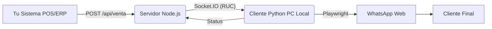

# Control-WHA 🤖📱

**Sistema de Automatización de Mensajería WhatsApp (Cliente-Servidor)**

Control-WHA es una solución robusta para enviar mensajes y archivos multimedia de WhatsApp de forma programática. Utiliza una arquitectura híbrida donde un **Servidor Central (Node.js)** orquesta las peticiones y las distribuye a múltiples **Clientes Locales (Python/Playwright)** ubicados físicamente en los negocios.

---

## 🚀 Nuevas Características (v2.0)

### 1. 🛡️ Portable y Sin Instalación

- **Ejecutable Único**: Copia la carpeta y funciona.
- **Base de Datos Inteligente**: Si no puede escribir en la carpeta de instalación, usa automáticamente `%APPDATA%` o carpetas temporales. ¡Cero errores de permisos!
- **Sesión Persistente**: Guarda el login de WhatsApp en una subcarpeta `whatsapp_session`, permitiendo mover el programa sin perder la sesión.

### 2. 📨 Cola de Mensajería (Queue) Robust

- **SQLite Integrado**: Procesa miles de mensajes sin colapsar el navegador.
- **Procesamiento Secuencial**: Envía 1 a 1 para comportamiento humano.
- **Reintentos y Estados**: Monitorea PENDING, PROCESSING, SENT, ERROR.

### 3. � Filtro Anti-Spam Inteligente

- **Detección de Duplicados**: Evita enviar el mismo mensaje al mismo número dos veces por error.
- **Ventana de Tiempo**: Solo bloquea si se repite en menos de **60 segundos**.
- **Comparación Exacta & Fuzzy**: (Configurable) Evita que pequeños cambios saturen al cliente.

### 4. �️ Monitoreo de Estado

- **Detector de Cierres**: Si el usuario cierra el navegador, el sistema avisa inmediatamente al servidor y al frontend ("Browser Closed Alert").
- **Logs CSV Blindados**: Registra todo en `conversations.csv`. Si el archivo está abierto/bloqueado por Excel, crea un backup automático para no perder datos.

### 5. ⚡ Ruteo Inteligente por RUC

- Soporte Multi-Cliente: Conecta cientos de negocios simultáneamente.
- **Política de Candado**: Si alguien intenta usar tu RUC en otra PC, el sistema protege la sesión original y bloquea al intruso.

---

## 🏛️ Arquitectura



---

## 📦 Uso Rápido

### A. Cliente (Usuario Final)

1.  Descargar la carpeta `dist`.
2.  Ejecutar **`WhatsAppClient.exe`**.
3.  Ingresar **RUC** y **Token** en el Asistente de Configuración.
4.  Escanear QR de WhatsApp.
5.  ¡Listo! Minimizar y dejar trabajando.

### B. Servidor (Despliegue)

1.  `cd socket-server`
2.  `npm install`
3.  `node index.js` (Recomendado usar PM2: `pm2 start index.js`)

**API Endpoint:**

- `POST /api/venta`
  ```json
  {
    "ruc": "20600000001",
    "phone_number": "51999999999",
    "message": "Hola, su comprobante es..."
  }
  ```

---

## 🛠️ Tecnologías

- **Python 3.12 + Playwright**: Automatización Browser.
- **Node.js + Socket.IO**: Realtime Server.
- **SQLite**: Cola persistente.
- **TheFuzz**: Algoritmos de similitud de texto.
- **Tkinter**: GUI nativa.
